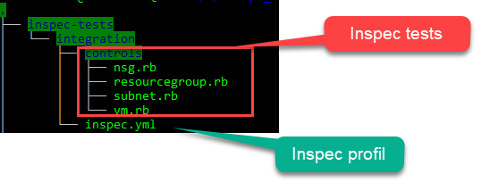

# Basic Azure tests

## Writing Inspec tests

### **The Inspec profile file**

After Inspec installation and authentication configuration we can start to use Inspec.  
The first step is to create tests folder structure and Inspec profile that define some metadata and Inspec configuration.

For create structure and profile execute the command:

```text
inspec init profile my-azureTests
```

This command create a new folder `”my-azureTests”` with all necessaries artifacts for inspec tests, with:

* controls \(tests\)
* libraries
* profil file **inspec.yml** with some default metadata

Then, we adapt and update this profil file with personal metadata and adding the information of the Azure Resource pack



The important information’s are the **inspec\_version: ‘&gt;= 2.2.7’** and the **depends section** with the url of the Inspec Azure resource pack.

After updating the profil file we can write tests…

### **The tests controls**

All tests are located in the controls folder and are write in Ruby file \(.rb\) with very simple syntax.  
For illustrate this article we will write tests for check one Resource group, one Virtual machine and one subnet.

In the controls folder create file “resourcegroup.rb” with this content:



This test check that the resource group named MyResourceGroup exist.

For the check of the Virtual Machine, create file “vm.rb” with this content sample



This above sample test of vm check :

* if my vm ‘prod-web-01’ exist in specified resource group,
* some extensions properties
* the region location
* the size of the vm
* the os type that Linux
* the number of the data disk that equal to 1

For the Subnet tests, add file “subnet.rb” with sample content:




The above subnet control check :

* if the subnet “subnet-web” exist in vnet “vnet-prod”
* the address prefix of the subnet is equal to 192.168.0.0/24
* if the subnet is attached to the network security group “my-nsg”

> Here I show only 3 examples of Azure resources, the complete list all available Azure resources in inspec pack are in the I[nspec documentation](https://www.inspec.io/docs/reference/resources/#azure-resources).

### Execute inspec tests

After writing inspec tests, we need to execute these tests for check the compliance of my Azure infrastructure.

> Before running your tests don’t forget to set the environment variables of your Azure credential like in above section “Configure Inspec for Azure”

For run these tests in the root of your main directory, in the terminal , execute the Inspec exec command:

```text
inspec exec <folder path of the inspec.yml> -t azure://
```

As an example with my Inspec tests:



I execute the command

```text
inspec exec inspec-tests/integration/ -t azure://
```

The result output of this execution is list of pass tests and failed tests, e.g :


Now with this, I can fix my Azure infrastructure and re-run Inspec tests until all the tests go green exactly like as the test methodology process of [TDD](https://en.wikipedia.org/wiki/Test-driven_development).

